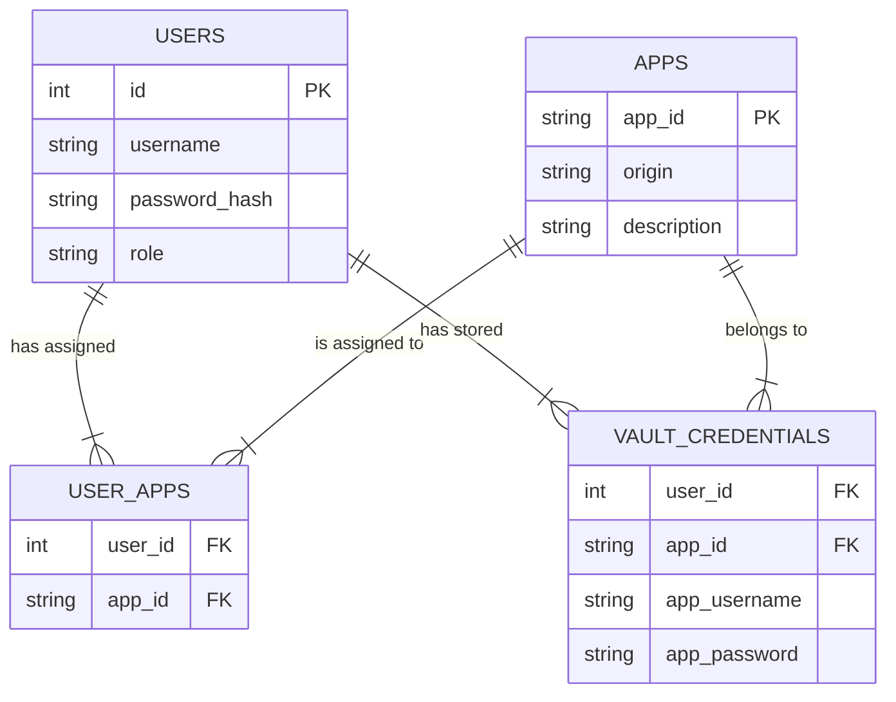

# Credential Store Architecture

The Primary Identity service manages users, applications, and their credentials in a relational database.

**Location:** `primary-identity/database.sqlite` (SQLite database)


## 📊 Database Schema



## 🔍 Table Details

### 1. `users` (Identity Provider Users)

The main users who login to http://localhost:4000
| Column | Type | Example |
|--------|------|---------|
| `id` | INTEGER PK | 1 |
| `username` | TEXT | 'testuser' |
| `password` | TEXT | 'TestPass123!' (In production: hashed) |
| `role` | TEXT | 'user' |

### 2. `apps` (Registered Legacy Apps)

The list of applications the system manages
| Column | Type | Example |
|--------|------|---------|
| `app_id` | TEXT PK | 'app_a' |
| `origin` | TEXT | 'http://localhost:3001' |
| `description` | TEXT | 'Legacy HR App' |

### 3. `user_apps` (Access Control)

Mapping table: **Which user can access which app?**
| Column | Type | Example |
|--------|------|---------|
| `user_id` | INTEGER FK | 1 (testuser) |
| `app_id` | TEXT FK | 'app_a' |

### 4. `vault_credentials` (The Password Vault)

Mapping table: **What credentials should be replayed?**
_This is where the extension fetches data from._
| Column | Type | Example |
|--------|------|---------|
| `user_id` | INTEGER FK | 1 (testuser) |
| `app_id` | TEXT FK | 'app_a' |
| `app_username` | TEXT | 'testuser' |
| `app_password` | TEXT | 's3cr3t_p4ss' |

---

## 🔗 How Mapping Works (Example)

1. **User Login**: `testuser` (ID: 1) logs into Primary Identity.
2. **Access Check**: System checks `user_apps` table.
   - Does User 1 have access to `app_a`? **YES**.
3. **Extension Request**: Extension asks for credentials for `app_a`.
4. **Vault Lookup**: System queries `vault_credentials`:
   ```sql
   SELECT app_username, app_password
   FROM vault_credentials
   WHERE user_id = 1 AND app_id = 'app_a';
   ```
5. **Result**: Returns `{ username: 'testuser', password: 's3cr3t_p4ss' }`.

---

## 📂 Physical Location

The actual database file is located at:

```
/home/shivhare/Downloads/accops/TEST3(new start)/primary-identity/database.sqlite
```

You can view it using the SQLite command line:

```bash
cd primary-identity
sqlite3 database.sqlite "SELECT * FROM vault_credentials;"
```
