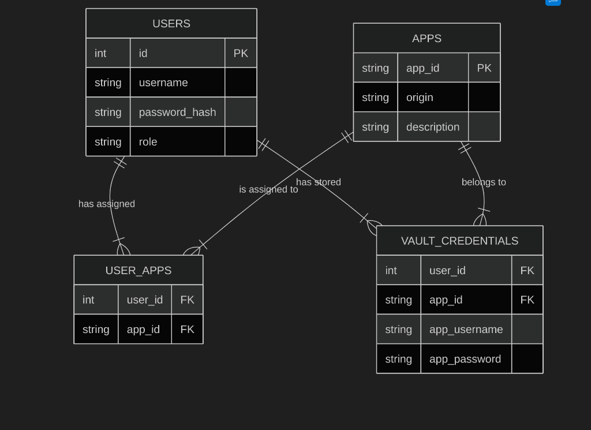

# Credential Store Architecture

The Primary Identity service manages users, applications, and their credentials in a relational database. It implements a **schema-driven** approach to support complex login requirements (like role selectors) alongside standard username/password logins.

**Location:** `primary-identity/database.sqlite` (SQLite database)



---

## 🎯 Schema-Driven Login Support

This system differs from traditional SSO by allowing applications to define their own login form structure.

### App Types Supported

| App Type    | Login Fields                   | Example             | Login Schema                         |
| ----------- | ------------------------------ | ------------------- | ------------------------------------ |
| **Simple**  | Username + Password            | App-A, App-B, App-C | Optional (defaults to standard)      |
| **Complex** | Username + Password + **Role** | **App-D**           | **Required** (defines role selector) |

### How It Works

1.  **Bootstrap**: Extension receives the `login_schema` for each authorized app.
2.  **Generic Filling**: The extension iterates through the schema fields to fill the form.
3.  **Role Support**: "Role" is just another field in the schema, treated generically.
4.  **Learning Mode**: Captures _all_ fields defined in the schema during first-time login.

---

## 📊 Database Schema

This diagram represents the **exact** structure of the SQLite database.

```mermaid
erDiagram
    USERS ||--|{ USER_APPS : "has assigned"
    APPS ||--|{ USER_APPS : "is assigned to"
    USERS ||--|{ VAULT_CREDENTIALS : "has stored"
    APPS ||--|{ VAULT_CREDENTIALS : "belongs to"
    USERS ||--|{ PLUGIN_TOKENS : "generates"

    USERS {
        int id PK
        string username UNIQUE
        string password_hash
        string role
    }

    APPS {
        int id PK
        string appId UNIQUE
        string origin
        string login_schema
    }

    USER_APPS {
        int user_id FK
        int app_id FK
    }

    VAULT_CREDENTIALS {
        int user_id FK
        int app_id FK
        string app_username
        string app_password
        string extra_fields
    }

    PLUGIN_TOKENS {
        int id PK
        string token UNIQUE
        int user_id FK
        string scopes
        int expires_at
    }
```

---

## 🔍 Table Details

### 1. `users` (Identity Provider Users)

Users who log in to the Primary Identity portal (http://localhost:4000).

| Column          | Type        | Description                                                              |
| --------------- | ----------- | ------------------------------------------------------------------------ |
| `id`            | INTEGER PK  | Auto-incrementing User ID                                                |
| `username`      | TEXT UNIQUE | Primary Identity username                                                |
| `password_hash` | TEXT        | Bcrypt hash of the user's password                                       |
| `role`          | TEXT        | Role in Primary Identity, CHECK constraint allows only 'admin' or 'user' |

### 2. `apps` (Registered Applications)

The legacy applications managed by the SSO system.

| Column         | Type        | Description                                           |
| -------------- | ----------- | ----------------------------------------------------- |
| `id`           | INTEGER PK  | Auto-incrementing App ID                              |
| `appId`        | TEXT UNIQUE | Unique string identifier (e.g., 'app_d')              |
| `origin`       | TEXT        | Web origin of the app (e.g., 'http://localhost:3004') |
| `login_schema` | TEXT        | JSON string defining form fields (selector & type)    |

**Example `login_schema` (App-D):**

```json
{
  "username": { "selector": "input[name='username']", "type": "text" },
  "password": { "selector": "input[name='password']", "type": "password" },
  "role": { "selector": "select[name='role']", "type": "select" }
}
```

### 3. `user_apps` (Access Control)

Mapping table defining which users are allowed to access which applications.

| Column    | Type       | Description           |
| --------- | ---------- | --------------------- |
| `user_id` | INTEGER FK | References `users.id` |
| `app_id`  | INTEGER FK | References `apps.id`  |

### 4. `vault_credentials` (The Password Vault)

Stores the credentials to be replayed into the legacy apps.

| Column         | Type       | Description                                           |
| -------------- | ---------- | ----------------------------------------------------- |
| `user_id`      | INTEGER FK | References `users.id`                                 |
| `app_id`       | INTEGER FK | References `apps.id`                                  |
| `app_username` | TEXT       | Username for the legacy app                           |
| `app_password` | TEXT       | Password for the legacy app (**Plain Text in PoC**)   |
| `extra_fields` | TEXT       | JSON string for extra data (e.g., `{"role":"admin"}`) |

### 5. `plugin_tokens` (Extension Auth)

Stores active sessions/tokens for the browser extension.

| Column       | Type        | Description                                                      |
| ------------ | ----------- | ---------------------------------------------------------------- |
| `id`         | INTEGER PK  | Auto-incrementing Token ID                                       |
| `token`      | TEXT UNIQUE | The bearer token string (format: `ptk_` + 32 random hex bytes)   |
| `user_id`    | INTEGER FK  | References `users.id`                                            |
| `scopes`     | TEXT        | JSON array of permissions (e.g., `["vault:read","vault:write"]`) |
| `expires_at` | INTEGER     | Expiration timestamp (Unix epoch seconds)                        |

---

## 🔗 SSO Flow Example (Role-Based)

Scenario: User logs into **App-D** (which requires a role).

1.  **Bootstrap**: Extension gets app list. `app_d` includes the `login_schema` with a "role" field.
2.  **Detection**: User visits `http://localhost:3004`. Extension detects the login form.
3.  **Fetch**: Extension requests credentials for `app_d`.
4.  **Response**:
    ```json
    {
      "appId": "app_d",
      "fields": {
        "username": "nikhil",
        "password": "secret_password",
        "role": "admin"
      }
    }
    ```
5.  **Fill**: Extension fills username, password, and selects "admin" in the role dropdown based on the schema.

---

## 🔐 Security Notes

> [!WARNING]
> **Proof of Concept Context**:
>
> - `vault_credentials.app_password` is stored in **PLAIN TEXT**.
> - `users.password_hash` uses bcrypt (secure).
> - In a real production environment, vault passwords **MUST** be encrypted (e.g., AES-256-GCM).

---

## 📂 Physical Location

Database file path:

```
/home/shivhare/Downloads/accops/TEST3(new start)/primary-identity/database.sqlite
```

**Useful Commands:**

```bash
# Open database
sqlite3 primary-identity/database.sqlite

# List all tables
.tables

# Check schema of a specific table
.schema apps
```
